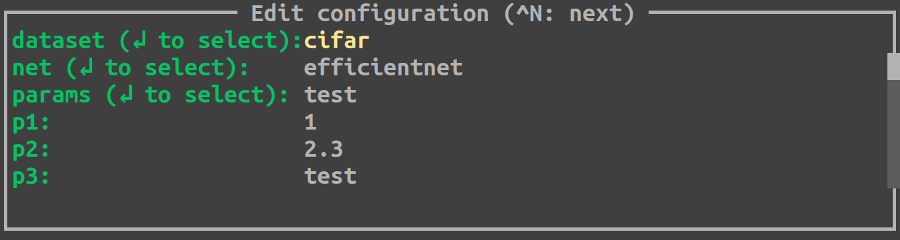
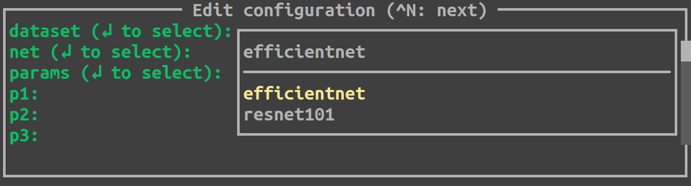
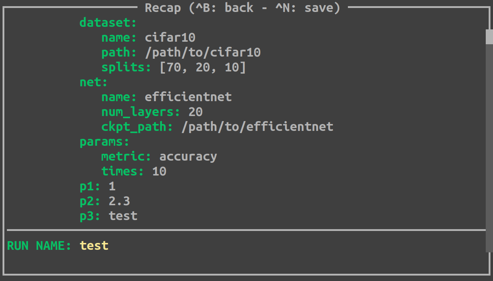

<p align="center">
    
</p>

---

<p align="center">
    <a href="https://pypi.org/project/hesiod/">
        
    </a>
    <a href="#">
        
    </a>
    <a href="https://github.com/psf/black">
        
    </a>
    <a href="http://mypy-lang.org/">
        
    </a>
    <a href="https://github.com/lykius/hesiod">
        
    </a>
</p>

## What is hesiod?
Hesiod is a simple python library which helps you to keep your configs clean.  
There are three main concepts used in hesiod:
* configs are defined hierarchically in files separated from the main code (no more `argparse`)
* you define a __template__ config structure just once (e.g. you can say "in every run I will need parameter p1, which is an integer, parameter p2, which must be selected among a predefined set of values, etc."); then, before starting a run, you can specifiy the actual config values used in that run in a super intuitive way, without creating new files for each run
* configs can be accessed anywhere in the code with several modalities.

## Example
Let's see it more concretely with an example.  
Imagine that you write some python program where you need a dataset, a neural network and other parameters (does it sound familiar?). Each run of your program will use a different dataset or a different network or different parameters. To achieve this, you can write a config file for each element and organize them in a hierarchy of directories, something like this:
```
cfg
|____ dataset
|    |
|    |____ cifar.yaml    
|    |____ imagenet.yaml
|
|____ net
|    |
|    |____ resnet101.yaml
|    |____ efficientnet.yaml
|
|____ params
     |
     |____ training.yaml
     |____ test.yaml
```
Each `.yaml` file contains the specific config for that element, for instance:
#### __cfg/dataset/cifar.yaml__
```yaml
name: "cifar10"
path: "/path/to/cifar10"
splits:
  - 70
  - 20
  - 10
```
#### __cfg/net/efficientnet.yaml__
```yaml
name: "efficientnet"
num_layers: 20
ckpt_path: "/path/to/efficientnet"
```
Then, you can define the generic __template__ config structure which will be used in every run, with a single `.yaml` file:
#### __template.yaml__
```yaml
dataset: "@BASE(dataset)"  # every run will need a dataset...
net: "@BASE(net)"          # ...and a network...
params: "@BASE(params)"    # ...and some params
p1: 1
p2: 2.3
p3: "test"
```
In the __template__ file you define which config will be used by every run, without specifying the actual set of values (but you can provide defaults). In this simple example, we use the placeholder `@BASE` which defines that the config values will be chosen among some _base_ configs. So, when you write `"@BASE(dataset)"`, hesiod will look for a directory named `dataset` and will ask you to choose among the options available in that directory (i.e. the `.yaml` files, in our example for `dataset` we have `cifar` and `imagenet`). In this example we also specify some params (`p1`, `p2` and `p3`) with default values.  
Once you have defined all your possibilities (i.e. all the _base_ configs) and a __template__ file, you just need to add hesiod to your program in the following way:
#### __main.py__
```python
@hmain(base_cfg_dir="./cfg", template_cfg_file"./template.yaml")
def main():
    # do some fancy stuff
    ...

if __name__ == "__main__":
    main()
```
As you can see, you just need to use hesiod special decorator `hmain` and to specify the path to the _base_ configs and the path to the file with the __template__ config structure.  
When you run this program, hesiod will present you a simple TUI (text-based user interface), where you will be able to select which config you want to use for the starting run:

<p align="center">
    
    
</p>

When you are done with your selections, you can confirm by pressing CTRL+N and hesiod will show a recap of the selected configuration:

<p align="center">
    
</p>

Here you can check that you selected the right things, you are asked to insert a name for current run and, finally, you can press CTRL+N to save the configuration and start the run (alternatively, you can press CTRL+B to go back and edit the config).  
When you confirm with CTRL+N hesiod creates a directory for the run and saves the resulting config in a file called `run.yaml` (by default, the new directory is created in a directory called `logs`, but you can change that). Then, hesiod terminates and the control goes to your program.

## How can I access configs in the program?
Hesiod defines two ways to access configs in your program:
* you can use the function `get_cfg_copy()` to get a copy of the whole config as a dictionary
* you can use the function `hcfg(key, type=None)` anywhere in your code to get a specific config value identified by `key`; for instance, in the above example, we can use `hcfg("dataset.name")` to get the name of the dataset (note the "dot" notation to navigate dictionaries); optionally, if you use types in your code (you should! 😁), you can specify the expected `type` for the requested parameter, enabling some type checking and helping your linter when using the returned parameter.

## What can I write in config files?
Each config file represents a key-value dictionary. For the time being, hesiod supports `.yaml` files and you can write anything that is compliant with the [YAML](https://yaml.org/) format:
```yaml
p1: 1  # integer
p2: 1.2  # float
p3: 1e-4  # another float
p4: true  # boolean
p5: "test"  # string
p6: [1, 2, 3]  # list
p7: !!python/tuple [1, 2, 3]  # tuple
p8: !!set {1: null, 2: null, 3: null}  # set
p9: 2021-01-01  # date
p10:  # dictionary that contains...
  p11:  # ...another dictionary that contains...
    p12: 10  # ...an integer and...
      p13: "11"  # ...a string and...
      p14: 12.0  # ...a float
```
Additionally, hesiod defines the special keyword `base`, which allows to load a config dictionary defined in another file. For instance, if we have:
#### __case1/subcase1/file1.yaml__
```yaml
p1: 1
p2: 2.0
p3: "3"
```
#### __file2.yaml__
```yaml
base: "case1.subcase1.file1"
p3: 3.456
```
when loading `file2.yaml`, hesiod will solve the `base` keyword by loading the content in `file1.yaml` without touching parameters that are overriden in `file2.yaml`, resulting in:
```yaml
p1: 1
p2: 2.0
p3: 3.456
```

## What can I write in a __template__ file?
__Template__ files can contain all the options available for normal config files. In addition, there are some special placeholders:
* `@BASE(key)` the user will select one of the base configs (i.e. `.yaml` files) available in the path specified by `key`. The key can represent a complete path with the notation `dir.subdir.subsubdir` etc.
* `@OPTIONS(opt1,opt2,opt3,...)` the user will select one of the given options.
* `@BOOL(true)` / `@BOOL(false)` the user will select between `TRUE` and `FALSE`, with the default set as specified.
* `@FILE` / `@FILE(path/to/default)` the user will select a file starting either from the current directory or from a default path.
* `@DATE` / `@DATE(today)` / `@DATE(YYYY-MM-DD)` the user will select a date, starting from today or from a default date.

## Can I skip the TUI?
Yes! The TUI is a powerful way to select and check your configs before running the program, but there are scenarios where you just need to load a config file without making any selection (for instance, when you prepare a script to launch several runs sequentially). To skip the TUI, you just need to modify slightly the arguments passed to `hmain`:
#### __main.py__
```python
@hmain(base_cfg_dir="./cfg", run_cfg_file"./run.yaml")
def main():
    # do some fancy stuff
    ...

if __name__ == "__main__":
    main()
```
Note that in this case we don't pass `template_cfg_file` but `run_cfg_file`, telling hesiod that we want only to load the content of the given run file, without showing any TUI. You can still use the keyword `base` to combine hierarchically multiple config files in a single run file. The only constraint is that the run file passed to hesiod must contain the run name, represented by the key `run_name`. Such run name will be used by hesiod to create the directory for the run and to save the run file in it.

## Can I restore a previous run?
Absolutely! If you pass to `hmain` the `run_cfg_file` argument with the path of a run file previously created by hesiod, this file will be loaded regularly but this time hesiod will not create a new directory for the run.

## How can I install hesiod?
Hesiod is on pypi, so you can simply:
```
pip install hesiod
```

## A more complete example
Have a look [here](https://github.com/lykius/hesiod-test) for a complete working example.

## Future development
Hopefully, hesiod will get many new features in the next few months, stay tuned!
