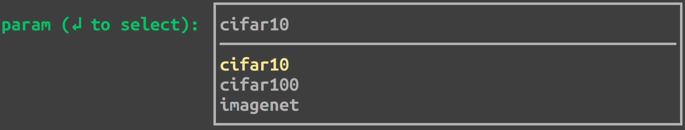
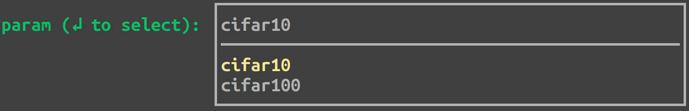
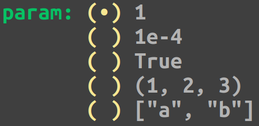
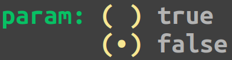
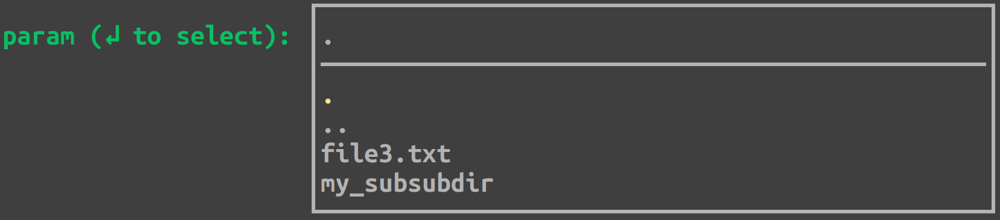
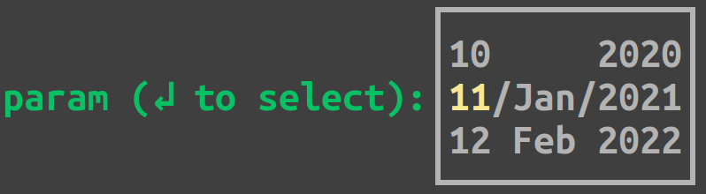

############
Config files
############
.. _configs:

Hesiod relies on config files, allowing you to create the config for your program with two simple
concepts:

1. You should define the configs for each **entity** of your program in a separate file.
2. You can combine configs hierarchically to compose the global config of your program.

********************
Config files content
********************

Each config file represents a key-value dictionary. For the time being, Hesiod supports ``.yaml``
files and you can write anything that is compliant with the `YAML <https://yaml.org/>`_ format:

.. code-block:: yaml

    p1: 1  # integer
    p2: 1.2  # float
    p3: 1e-4  # another float
    p4: true  # boolean
    p5: "test"  # string
    p6: [1, 2, 3]  # list
    p7: !!python/tuple [1, 2, 3]  # tuple
    p8: !!set {1: null, 2: null, 3: null}  # set
    p9: 2021-01-01  # date
    p10:  # dictionary that contains...
      p11:  # ...another dictionary that contains...
        p12: 10  # ...an integer and...
        p13: "11"  # ...a string and...
        p14: 12.0  # ...a float

******************
The base mechanism
******************
.. _base-mechanism:

One of the key elements in Hesiod is the **base mechanism**, triggered by the use of
the special keyword ``base``. The first step to use the base mechanism consists in defining base
configs in a directory of your choice. This directory could be something like this ("scenario1",
"case1", "case2", "scenario2", etc. are just examples, they can be whatever you like)::

    cfg/bases
    |
    |____ scenario1
    |    |
    |    |____ case1
    |    |    |____ params1.yaml
    |    |    |____ params2.yaml
    |    |
    |    |____ case2
    |         |____ params1.yaml
    |         |____ params2.yaml
    |
    |____ scenario2
         |
         |____ ...

You tell Hesiod where it can find your base configs by specifying the path to the
bases directory in the ``hmain`` decorator (i.e. ``@hmain(base_cfg_dir="cfg/bases", ...)``).

Then, you can use the keyword ``base`` to load in the current file the config dictionary defined in
some base file. For instance, if we have:

.. code-block:: yaml

    # cfg/bases/scenario1/case2/params2.yaml

    p1: 1
    p2: 2.0
    p3: "3"

You can load the base ``scenario1.case2.params2`` by doing:

.. code-block:: yaml

    # config.yaml

    base: "scenario1.case2.params2"
    p3: 3.456

Hesiod will solve the ``base`` keyword in ``config.yaml`` by loading in it the content from
``cfg/bases/scenario1/case2/params2.yaml``, without touching the parameters that are overriden in
``config.yaml``. The result is a config defined as:

.. code-block:: yaml

    p1: 1
    p2: 2.0
    p3: 3.456

***************************
Run files vs Template files
***************************

In Hesiod you have two options:

1. You can define a **run** file with the specific configs for each run of your program.
2. You can define a **template** file with the abstract structure of the config, without
   specifying any actual value.

Run files
=========

Run files are normal config files, where you can compose configs with the base mechanism and/or
specify additional parameters. Using the bases dir defined above, a valid run file could be:

.. code-block:: yaml

    # run.yaml

    first_scenario:
      base: "scenario1.case2.params1"
    second_scenario:
      base: "scenario2.case1.params2"
    some_param: 1e-5
    another_param: "test"
    a_group_of_params:
      p1: 1
      p2: true
      p3: ["a", "b", "c"]

    run_name: "very_cool_run"

Note that every run file must contain a valid ``run_name``, that will be used by Hesiod to create
an output directory for the run (named accordingly).

Template files
==============

**Run** files allows you to separate configs from your code, but are not very flexible and, most
importantly, require you to prepare run files manually for each run, which is tedious and error
prone. To overcome these limitations, Hesiod introduces the concept of **template**
config files, where you define a generic structure for your config, without specifying the actual
values that will be used in every run.

**Template** files can contain all the options available for normal config files. In addition,
there are some special placeholders:

.. list-table::
    :widths: 20 80
    :header-rows: 1

    * - Placeholder
      - Description
    * - ``@BASE(key)``
      - The user will select one of the base configs (i.e. ``.yaml`` files) 
      
        available in the path specified by ``key``. The key can represent a
        
        complete path with the notation ``dir.subdir.subsubdir`` etc.
    * - ``@OPTIONS(opt1;opt2;opt3;...)``
      - The user will select one of the given options.
    * - ``@BOOL(true)``
    
        ``@BOOL(false)``
      - The user will select between ``TRUE`` and ``FALSE``,
      
        with the default set as specified.
    * - ``@FILE``
    
        ``@FILE(path/to/default)``
      - The user will select a file/dir starting either from
        
        the current directory or from a default path.
    * - ``@DATE``
        
        ``@DATE(today)``
        
        ``@DATE(YYYY-MM-DD)``
      - The user will select a date, starting from today or from a default date.

Template config files are processed by Hesiod to create a TUI (Text-base User Interface), where
the user will be able to fill/select config values. Each config in the template file is associated
with a TUI widget, whose kind depends on the config itself.

Literal configs
---------------

Literal configs are configs in the form ``key: value``, where key is a string and value is also a
string that can represent any literal value (integers, floats, booleans, tuples, lists, ecc.).
These configs are treated as plain strings in the TUI, so that you can edit value in any way you
want. Hesiod will process the final value with the python interpreter and will cast it to a proper
type if the interpreter recognizes it as such.

``@BASE`` configs
-----------------

Configs that use the ``@BASE`` placeholder are in the form ``key: "@BASE(basekey)"``, where key is a
string and basekey is a string indicating the bases directory where Hesiod must look to gather all
the options for the config. Let's say that your bases directory looks like this::

    cfg/bases
    |
    |____ dataset
         |
         |____ cifar
         |    |____ cifar10.yaml
         |    |____ cifar100.yaml
         |
         |____ imagenet.yaml

If you write ``param: "@BASE(dataset)"`` in your template file, you will get a widget like this:

The basekey can represent sub directories with the notation ``dir.subdir.subsubdir...``. So, if you
write ``param: "@BASE(dataset.cifar)"`` in your template file, your options will be reduced to:

``@OPTIONS`` configs
--------------------

Configs that use the ``@OPTIONS`` placeholder are in the form ``key: "@OPTIONS(opt1;opt2;...)"``,
where key is a string and opt1, opt2, etc. represent the available options for the config. Options
can be any string and, as usual, will be converted by Hesiod in the type detected by the python
interpreter, if possible.

If you write ``param: "@OPTIONS(1;1e-4;True;(1, 2, 3);[\"a\", \"b\"])"`` in your template file, you
will be presented with the following widget in the TUI:

``@BOOL`` configs
-----------------

Configs that use the ``@BOOL`` placeholder are either in the form ``key: "@BOOL(true)"`` or in the
form ``key: "@BOOL(false)"``, where key is a string and the value between parenthesis indicates the
default for the config.

If you write ``param: "@BOOL(false)"`` in your template file, you will get a widget like this:

``@FILE`` configs
-----------------

Configs that use the ``@FILE`` placeholder are either in the form ``key: "@FILE"`` or in the form
``key: "@FILE(/path/to/default)"``, where key is a string and the optional value between parenthesis
indicates the default path for the config. This kind of config, in fact, allows the user to select
a path, that can be both a file or a directory. Let's say you have a directory that looks like this::

    my_dir
    |
    |____ my_subdir
         |
         |____ my_subsub_dir
         |    |____ file1.txt
         |    |____ file2.txt
         |
         |____ file3.txt

If you write ``param: "@FILE(my_dir/my_subdir)"`` in your template file, the TUI will present a 
widget like this:

``@DATE`` configs
-----------------

Configs that use the ``@DATE`` placeholder are either in the form ``key: "@DATE"`` or in the form
``key: "@DATE(default)"``, where key is a string and the optional value between parenthesis is the
default date for the config. The default date can be either "today" or a date in the format
``YYYY-MM-DD`` (e.g. 2021-01-11).

If you write ``param: "@DATE(2021-01-11)"`` in your template file, you will be presented with the
following widget:

