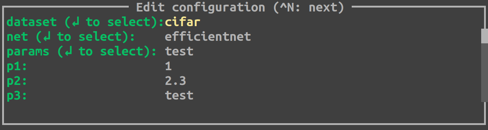
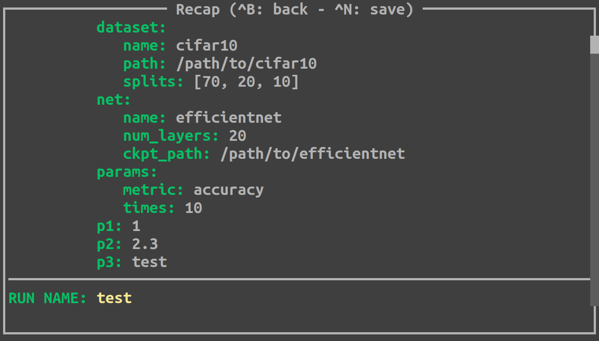

##########
Quickstart
##########

Let's introduce Hesiod with an example.

************
Config files
************

Imagine that you write some python program where you need a dataset, a neural network 
and other parameters. Each run of your program will use a different dataset or a different 
network or different parameters. To achieve this, you can write a config file for each element 
and organize them in a hierarchy of directories, something like this::

    cfg
    |____ dataset
    |    |
    |    |____ cifar.yaml    
    |    |____ imagenet.yaml
    |
    |____ net
    |    |
    |    |____ resnet101.yaml
    |    |____ efficientnet.yaml
    |
    |____ params
         |
         |____ training.yaml
         |____ test.yaml

Each ``.yaml`` file contains the specific config for that element, for instance:

.. code-block:: yaml

    # cfg/dataset/cifar.yaml
    name: "cifar10"
    path: "/path/to/cifar10"
    splits: [70, 20, 10]

    # cfg/dataset/imagenet.yaml
    name: "imagenet"
    path: "/path/to/imagenet"
    splits: [80, 10, 10]

    # cfg/net/resnet101.yaml
    name: "resnet101"
    num_layers: 101
    ckpt_path: "/path/to/resnet101"

    # cfg/net/efficientnet.yaml
    name: "efficientnet"
    num_layers: 20
    ckpt_path: "/path/to/efficientnet"

    # cfg/params/training.yaml
    optimizer: "SGD"
    lr: 1e-4

    # cfg/params/test.yaml
    metric: "accuracy"
    times: 10

*********
Run files
*********

A first option, now, is to create a **run** file where you combine the configs according to 
what you intend to do in a specific run. For instance, you could do something like:

.. code-block:: yaml

    # run.yaml

    dataset:
        base: "dataset.cifar"
        splits: [60, 30, 10]
    net:
        base: "net.efficientnet"
    params:
        base: "params.training"
        lr: 1e-3
    others:
        log_dir: "/path/to/logs"
    
    run_name: "train_efficientnet_on_cifar"

As you may see, Hesiod allows you to combine config files with the 
:ref:`base mechanism <base-mechanism>`. Of course, you are not limited to that and you can both:

* override base configs values
* add new configs.

**********************
Hesiod hmain decorator
**********************

You're almost good to go. You just need to wrap your code with Hesiod decorator ``hmain``, 
setting the path to the dir with the base configs and the path to the run file that you created 
for the run. Your main file could be something like:

.. code-block:: python

    # main.py

    from hesiod import hmain

    @hmain(base_cfg_dir="./cfg", run_cfg_file="./run.yaml")
    def main():
        # do some fancy stuff
        ...

    if __name__ == "__main__":
        main()

When you run ``main.py``, Hesiod will read ``run.yaml`` and load all your configs by resolving 
all the bases. Then, it will create an output directory for the current run, named as you 
specified in the field ``run_name`` in ``run.yaml``. Finally, Hesiod will save in the newly 
created output directory a single ``.yaml`` file with the completely specified version of the 
config of the run (i.e. with all the bases resolved). After all that, Hesiod will run your ``main`` 
function leaving it completely unchanged.

************************************
Get the config values in the program
************************************

There are two options to access config values in a program wrapped in Hesiod.

The function get_cfg_copy
=========================

Anywhere in the code, you can use the function ``hesiod.get_cfg_copy()`` to get a copy of the 
whole config. The config is a returned as a single dictionary with string keys. 
In the example above, for instance, you can do the following:

.. code-block:: python

    from hesiod import get_cfg_copy
    
    cfg = get_cfg_copy()
    dataset_name = cfg["dataset"]["name"]  # -> cifar10

The function hcfg
=================

Alternativerly, Hesiod offers an even more direct approach to get a config value. 
Anywhere in the code, you can use the function ``hesiod.hcfg(key, type=None)`` to get the 
value of one specific config. The ``key`` argument can be a composition of keys and subkeys, 
separated by dots (e.g. "key.subkey1.subkey2"). The type argument is optional, but it provides two 
advantages: it enables Hesiod to perform some type checking and it makes the linter life easier, 
by casting the returned value to the proper type. You can use the ``hcfg()`` function like this:

.. code-block:: python

    from hesiod import hcfg

    dataset_name = hcfg("dataset.name", str)  # -> cifar10

**************
Template files
**************

So far, we have seen that it is possible to define a **run** file for each run of your program.
This allows to separate your configs from your code, but it's not very flexible and, most
importantly, it requires you to prepare run files manually for every run, which is tedious
and error prone. To overcome these limitations, Hesiod introduces the concept of **template**
config files, where you define a generic structure for your config, without specifying the actual
values that will be used in every run. A valid **template** file for our example could be:

.. code-block:: yaml

    # template.yaml

    dataset: "@BASE(dataset)"  # every run will need a dataset...
    net: "@BASE(net)"          # ...and a network...
    params: "@BASE(params)"    # ...and some params
    p1: 1
    p2: 2.3
    p3: "test"

As you may see, in the **template** file you can use special **placeholders** to define,
for instance, that a specific config (e.g. dataset) will be selected among the bases contained
in the base directory "dataset". By doing that, you can define the generic structure of the configs
needed in your program, postponing the selection of specific values to the moment in which the
program will be executed.

To use a **template** config file, instead of a **run** file, you need to make a small change
to the args passed to ``hmain``:

.. code-block:: python

    # main.py

    from hesiod import hmain

    @hmain(base_cfg_dir="./cfg", template_cfg_file="./template.yaml")
    def main():
        # do some fancy stuff
        ...

    if __name__ == "__main__":
        main()

At this point, you may say "this sounds interesting, but how do I specify the actual values for a
run of my program when using template files?". Well, bear with me and keep reading.

*******************************
TUI (Text-based User Interface)
*******************************

When you run ``main.py``, you will be presented with a Text-based User Interface (TUI), where
you will be able to fill with actual values the config specified in the template file:

Depending on how you specified configs in the template file, you can fill values with different
modalities. If you used the ``@BASE`` decorator (like we did for dataset, net and params), Hesiod
will load all the possibility for each base and, for example, if you press ``ENTER`` on the field
"net" you will be able to select among "efficientnet" and "resnet101":

.. image:: ../../images/edit2.png
    :width: 80%
    :align: center

When you are done editing and selecting values for all your configs, you can press ``CTRL+N`` and
Hesiod will show you a recap of the whole config.

If you spot something wrong, you can go back and edit the configs by pressing ``CTRL+B``.
Otherwise, you can insert a name for this specific run and press ``CTRL+N`` to close the TUI. 
Hesiod will conclude its execution, as always, by creating an output directory for the current run,
named as you requested, and by saving in this directory a single ``.yaml`` file with the completely
specified version of the config of the run. The control goes now back to your program, where you
will be able to access configs in the exact same way as stated above.
